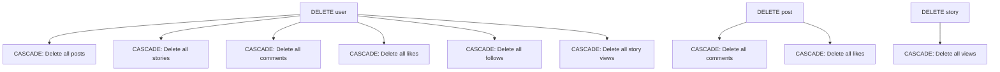

# Shelbook - Architecture & System Design

> **A decentralized social media platform built on Aptos blockchain with Shelby Protocol**

## Table of Contents
- [System Overview](#system-overview)
- [Technology Stack](#technology-stack)
- [Architecture Diagram](#architecture-diagram)
- [Database Schema](#database-schema)
- [API Endpoints](#api-endpoints)
- [Upload Flow](#upload-flow)
- [Story Feature](#story-feature)
- [Authentication Flow](#authentication-flow)

---

## System Overview

Shelbook is a Facebook-style social media application that combines:
- **Decentralized Storage** - Files stored on Aptos blockchain via Shelby Protocol
- **Traditional Database** - Metadata and relationships in Supabase (PostgreSQL)
- **Web3 Authentication** - Wallet-based login (no passwords)
- **Modern UI/UX** - Responsive Facebook-inspired interface

---

## Technology Stack

### Frontend
- **Framework:** Next.js 16 (App Router with React Server Components)
- **Styling:** Tailwind CSS v4
- **UI Components:** shadcn/ui + Radix UI
- **State Management:** React Hooks (useState, useEffect, useMemo)
- **Wallet:** @aptos-labs/wallet-adapter-react

### Backend
- **API:** Next.js API Routes (serverless)
- **Database:** Supabase (PostgreSQL)
- **Authentication:** Cookie-based sessions
- **Storage:** Shelby Protocol (Aptos blockchain)

### Blockchain
- **Network:** Aptos
- **Storage Protocol:** Shelby Protocol
- **File Encoding:** Custom encoding for on-chain commitment
- **Blob Storage:** Shelby RPC nodes

---

## Architecture Diagram

```
┌─────────────────────────────────────────────────────────────┐
│                         Frontend (Next.js)                   │
│  ┌──────────────┐  ┌──────────────┐  ┌──────────────┐      │
│  │   Home Feed  │  │   Stories    │  │   Profile    │      │
│  └──────────────┘  └──────────────┘  └──────────────┘      │
│  ┌──────────────┐  ┌──────────────┐  ┌──────────────┐      │
│  │  Post Modal  │  │  Story Modal │  │   Explore    │      │
│  └──────────────┘  └──────────────┘  └──────────────┘      │
└─────────────────────────────────────────────────────────────┘
                            ↓
┌─────────────────────────────────────────────────────────────┐
│                    API Layer (Next.js Routes)                │
│  /api/posts      /api/stories     /api/users                │
│  /api/upload     /api/auth        /api/comments             │
└─────────────────────────────────────────────────────────────┘
         ↓                              ↓
┌──────────────────────┐    ┌──────────────────────┐
│   Shelby Protocol    │    │      Supabase        │
│  (Aptos Blockchain)  │    │    (PostgreSQL)      │
│                      │    │                      │
│  • File Storage      │    │  • Users             │
│  • Blob Commitments  │    │  • Posts             │
│  • RPC Upload        │    │  • Stories (24h)     │
│  • Decentralized     │    │  • Comments          │
│  • On-chain Proofs   │    │  • Likes             │
│                      │    │  • Follows           │
└──────────────────────┘    └──────────────────────┘
```

---

## Database Schema

### Entity Relationship Diagram

```mermaid
erDiagram
    users ||--o{ posts : creates
    users ||--o{ stories : creates
    users ||--o{ comments : writes
    users ||--o{ likes : makes
    users ||--o{ story_views : views
    users ||--o{ follows : follows_as_follower
    users ||--o{ follows : followed_as_following
    posts ||--o{ comments : has
    posts ||--o{ likes : receives
    stories ||--o{ story_views : receives

    users {
        uuid id PK
        text wallet_address UK "Aptos wallet"
        text username UK
        text display_name
        text avatar_url
        text bio
        timestamptz created_at
        timestamptz updated_at
    }

    posts {
        uuid id PK
        uuid user_id FK
        text shelby_file_id "Blockchain blob"
        text shelby_file_url "CDN URL"
        text file_type "image/video"
        text caption
        int media_width
        int media_height
        timestamptz created_at
        timestamptz updated_at
    }

    stories {
        uuid id PK
        uuid user_id FK
        text shelby_file_id "Blockchain blob"
        text shelby_file_url "CDN URL"
        text file_type "image/video"
        text caption "max 150 chars"
        int media_width
        int media_height
        timestamptz created_at
        timestamptz expires_at "24h expiry"
        timestamptz updated_at
    }

    comments {
        uuid id PK
        uuid user_id FK
        uuid post_id FK
        text content
        timestamptz created_at
        timestamptz updated_at
    }

    likes {
        uuid id PK
        uuid user_id FK
        uuid post_id FK
        timestamptz created_at
    }

    follows {
        uuid id PK
        uuid follower_id FK
        uuid following_id FK
        timestamptz created_at
    }

    story_views {
        uuid id PK
        uuid story_id FK
        uuid user_id FK
        timestamptz viewed_at
    }
```



---

### Table Definitions

#### 📋 **users** - User Accounts
```
╔═══════════════════╦══════════════╦═════════════════════════════════╗
║ Column            ║ Type         ║ Constraints                     ║
╠═══════════════════╬══════════════╬═════════════════════════════════╣
║ id                ║ UUID         ║ PRIMARY KEY, DEFAULT gen_uuid() ║
║ wallet_address    ║ TEXT         ║ UNIQUE, NOT NULL                ║
║ username          ║ TEXT         ║ UNIQUE                          ║
║ display_name      ║ TEXT         ║                                 ║
║ avatar_url        ║ TEXT         ║                                 ║
║ bio               ║ TEXT         ║                                 ║
║ created_at        ║ TIMESTAMPTZ  ║ DEFAULT NOW()                   ║
║ updated_at        ║ TIMESTAMPTZ  ║ DEFAULT NOW()                   ║
╚═══════════════════╩══════════════╩═════════════════════════════════╝

Indexes:
  • idx_users_wallet_address ON wallet_address (unique lookup)
  
Description: Core user table storing wallet-based accounts
```

#### 📸 **posts** - User Posts
```
╔═══════════════════╦══════════════╦═════════════════════════════════╗
║ Column            ║ Type         ║ Constraints                     ║
╠═══════════════════╬══════════════╬═════════════════════════════════╣
║ id                ║ UUID         ║ PRIMARY KEY, DEFAULT gen_uuid() ║
║ user_id           ║ UUID         ║ FOREIGN KEY → users(id)         ║
║ shelby_file_id    ║ TEXT         ║ NOT NULL (Blockchain blob ID)   ║
║ shelby_file_url   ║ TEXT         ║ NOT NULL (CDN URL)              ║
║ file_type         ║ TEXT         ║ CHECK (image/video)             ║
║ caption           ║ TEXT         ║                                 ║
║ media_width       ║ INTEGER      ║                                 ║
║ media_height      ║ INTEGER      ║                                 ║
║ created_at        ║ TIMESTAMPTZ  ║ DEFAULT NOW()                   ║
║ updated_at        ║ TIMESTAMPTZ  ║ DEFAULT NOW()                   ║
╚═══════════════════╩══════════════╩═════════════════════════════════╝

Indexes:
  • idx_posts_user_id ON user_id (user's posts)
  • idx_posts_created_at ON created_at DESC (feed ordering)
  
Foreign Keys:
  • user_id → users(id) ON DELETE CASCADE

Description: Permanent posts with media stored on Shelby Protocol
```

#### 🎬 **stories** ⭐ NEW - Temporary Stories
```
╔═══════════════════╦══════════════╦═════════════════════════════════╗
║ Column            ║ Type         ║ Constraints                     ║
╠═══════════════════╬══════════════╬═════════════════════════════════╣
║ id                ║ UUID         ║ PRIMARY KEY, DEFAULT gen_uuid() ║
║ user_id           ║ UUID         ║ FOREIGN KEY → users(id)         ║
║ shelby_file_id    ║ TEXT         ║ NOT NULL (Blockchain blob ID)   ║
║ shelby_file_url   ║ TEXT         ║ NOT NULL (CDN URL)              ║
║ file_type         ║ TEXT         ║ CHECK (image/video)             ║
║ caption           ║ TEXT         ║ MAX 150 chars                   ║
║ media_width       ║ INTEGER      ║                                 ║
║ media_height      ║ INTEGER      ║                                 ║
║ created_at        ║ TIMESTAMPTZ  ║ DEFAULT NOW()                   ║
║ expires_at        ║ TIMESTAMPTZ  ║ DEFAULT NOW() + INTERVAL '24h'  ║
║ updated_at        ║ TIMESTAMPTZ  ║ DEFAULT NOW()                   ║
╚═══════════════════╩══════════════╩═════════════════════════════════╝

Indexes:
  • idx_stories_user_id ON user_id (user's stories)
  • idx_stories_created_at ON created_at DESC (story ordering)
  • idx_stories_expires_at ON expires_at (cleanup queries)
  
Foreign Keys:
  • user_id → users(id) ON DELETE CASCADE

Description: 24-hour temporary stories, auto-expire after expires_at
```

#### 💬 **comments** - Post Comments
```
╔═══════════════════╦══════════════╦═════════════════════════════════╗
║ Column            ║ Type         ║ Constraints                     ║
╠═══════════════════╬══════════════╬═════════════════════════════════╣
║ id                ║ UUID         ║ PRIMARY KEY, DEFAULT gen_uuid() ║
║ user_id           ║ UUID         ║ FOREIGN KEY → users(id)         ║
║ post_id           ║ UUID         ║ FOREIGN KEY → posts(id)         ║
║ content           ║ TEXT         ║ NOT NULL                        ║
║ created_at        ║ TIMESTAMPTZ  ║ DEFAULT NOW()                   ║
║ updated_at        ║ TIMESTAMPTZ  ║ DEFAULT NOW()                   ║
╚═══════════════════╩══════════════╩═════════════════════════════════╝

Indexes:
  • idx_comments_post_id ON post_id (post's comments)
  • idx_comments_user_id ON user_id (user's comments)
  
Foreign Keys:
  • user_id → users(id) ON DELETE CASCADE
  • post_id → posts(id) ON DELETE CASCADE

Description: User comments on posts
```

#### ❤️ **likes** - Post Likes
```
╔═══════════════════╦══════════════╦═════════════════════════════════╗
║ Column            ║ Type         ║ Constraints                     ║
╠═══════════════════╬══════════════╬═════════════════════════════════╣
║ id                ║ UUID         ║ PRIMARY KEY, DEFAULT gen_uuid() ║
║ user_id           ║ UUID         ║ FOREIGN KEY → users(id)         ║
║ post_id           ║ UUID         ║ FOREIGN KEY → posts(id)         ║
║ created_at        ║ TIMESTAMPTZ  ║ DEFAULT NOW()                   ║
╚═══════════════════╩══════════════╩═════════════════════════════════╝

Constraints:
  • UNIQUE(user_id, post_id) - One like per user per post
  
Indexes:
  • idx_likes_post_id ON post_id (post's like count)
  • idx_likes_user_id ON user_id (user's liked posts)
  
Foreign Keys:
  • user_id → users(id) ON DELETE CASCADE
  • post_id → posts(id) ON DELETE CASCADE

Description: Track which users liked which posts
```

#### 👥 **follows** - User Relationships
```
╔═══════════════════╦══════════════╦═════════════════════════════════╗
║ Column            ║ Type         ║ Constraints                     ║
╠═══════════════════╬══════════════╬═════════════════════════════════╣
║ id                ║ UUID         ║ PRIMARY KEY, DEFAULT gen_uuid() ║
║ follower_id       ║ UUID         ║ FOREIGN KEY → users(id)         ║
║ following_id      ║ UUID         ║ FOREIGN KEY → users(id)         ║
║ created_at        ║ TIMESTAMPTZ  ║ DEFAULT NOW()                   ║
╚═══════════════════╩══════════════╩═════════════════════════════════╝

Constraints:
  • UNIQUE(follower_id, following_id) - Can't follow twice
  • CHECK(follower_id != following_id) - Can't follow yourself
  
Indexes:
  • idx_follows_follower_id ON follower_id (who user follows)
  • idx_follows_following_id ON following_id (user's followers)
  
Foreign Keys:
  • follower_id → users(id) ON DELETE CASCADE
  • following_id → users(id) ON DELETE CASCADE

Description: User follow relationships (who follows whom)
```

#### 👁️ **story_views** ⭐ NEW - Story View Tracking
```
╔═══════════════════╦══════════════╦═════════════════════════════════╗
║ Column            ║ Type         ║ Constraints                     ║
╠═══════════════════╬══════════════╬═════════════════════════════════╣
║ id                ║ UUID         ║ PRIMARY KEY, DEFAULT gen_uuid() ║
║ story_id          ║ UUID         ║ FOREIGN KEY → stories(id)       ║
║ user_id           ║ UUID         ║ FOREIGN KEY → users(id)         ║
║ viewed_at         ║ TIMESTAMPTZ  ║ DEFAULT NOW()                   ║
╚═══════════════════╩══════════════╩═════════════════════════════════╝

Constraints:
  • UNIQUE(story_id, user_id) - One view per user per story
  
Indexes:
  • idx_story_views_story_id ON story_id (story's view count)
  • idx_story_views_user_id ON user_id (user's viewed stories)
  
Foreign Keys:
  • story_id → stories(id) ON DELETE CASCADE
  • user_id → users(id) ON DELETE CASCADE

Description: Track who viewed which stories (future feature)
```

---

### Data Integrity Rules



#### Unique Constraints
- ✅ One wallet address per user
- ✅ One username per user  
- ✅ One like per user per post
- ✅ One follow relationship per user pair
- ✅ One view record per user per story

#### Check Constraints
- ✅ file_type must be 'image' or 'video'
- ✅ follower_id ≠ following_id (can't self-follow)
- ✅ expires_at > created_at (stories)

---

## API Endpoints

### Authentication
```
POST   /api/auth/login      - Create session (wallet address)
POST   /api/auth/logout     - Destroy session
```

### Posts
```
GET    /api/posts           - Fetch all posts with user data
POST   /api/upload          - Upload post (via Shelby)
GET    /api/posts/[id]      - Get single post
DELETE /api/posts/[id]      - Delete post
POST   /api/posts/[id]/like - Toggle like
GET    /api/posts/[id]/comments - Get comments
POST   /api/posts/[id]/comments - Add comment
```

### Stories ⭐ NEW
```
GET    /api/stories         - Fetch active stories (< 24h)
POST   /api/stories         - Upload story (via Shelby)
```

### Users
```
GET    /api/users/[id]      - Get user profile
PATCH  /api/users/[id]      - Update profile (upsert)
POST   /api/users/[id]/follow - Toggle follow
```

---

## Upload Flow

### Post/Story Upload Process

```
┌─────────────────────────────────────────────────────────┐
│ 1. USER SELECTS FILE                                    │
│    - Image or Video (max 100MB)                         │
│    - Add caption (optional)                             │
└────────────────────┬────────────────────────────────────┘
                     ↓
┌─────────────────────────────────────────────────────────┐
│ 2. ENCODE FILE (10%)                                    │
│    - Convert file to chunks                             │
│    - Create commitments for blockchain                  │
│    - Prepare for on-chain submission                    │
└────────────────────┬────────────────────────────────────┘
                     ↓
┌─────────────────────────────────────────────────────────┐
│ 3. SUBMIT TO BLOCKCHAIN (30%)                           │
│    - Submit file commitments to Aptos                   │
│    - Create on-chain proof of storage                   │
│    - Generate blob ID                                   │
└────────────────────┬────────────────────────────────────┘
                     ↓
┌─────────────────────────────────────────────────────────┐
│ 4. UPLOAD TO SHELBY RPC (60%)                           │
│    - Upload actual file data to Shelby nodes            │
│    - Distribute across decentralized network            │
│    - Get CDN URL for retrieval                          │
└────────────────────┬────────────────────────────────────┘
                     ↓
┌─────────────────────────────────────────────────────────┐
│ 5. SAVE TO DATABASE (90%)                               │
│    - Store metadata in Supabase                         │
│    - Link file URL to user                              │
│    - Set expiry (stories only: 24h)                     │
└────────────────────┬────────────────────────────────────┘
                     ↓
┌─────────────────────────────────────────────────────────┐
│ 6. COMPLETE (100%)                                      │
│    - Refresh UI                                         │
│    - Show post/story                                    │
│    - Redirect/close modal                               │
└─────────────────────────────────────────────────────────┘
```

### File Storage Structure
```
Shelby CDN URL Format:
https://api.shelbynet.shelby.xyz/v1/blobs/{walletAddress}/{blobName}

Post Blob Name:
{timestamp}-{filename}

Story Blob Name:
story-{timestamp}-{filename}
```

---

## Story Feature

### Overview
Stories are temporary posts that expire after 24 hours, similar to Instagram/Facebook Stories.

### Key Features
- **24-Hour Expiry** - Auto-deleted after `expires_at` timestamp
- **Shelby Storage** - Same decentralized protocol as posts
- **Image & Video** - Both formats supported
- **Optional Captions** - Up to 150 characters
- **View Tracking** - Track who viewed (future feature)

### Story Lifecycle

```
┌──────────────┐
│  User Posts  │
│    Story     │
└──────┬───────┘
       ↓
┌──────────────────────────────────┐
│  Upload via Shelby Protocol      │
│  (same as posts)                 │
└──────┬───────────────────────────┘
       ↓
┌──────────────────────────────────┐
│  Saved to Database                │
│  - created_at: NOW()             │
│  - expires_at: NOW() + 24h       │
└──────┬───────────────────────────┘
       ↓
┌──────────────────────────────────┐
│  Visible for 24 Hours            │
│  - Shows in stories carousel     │
│  - Full-screen viewing           │
│  - User avatars with rings       │
└──────┬───────────────────────────┘
       ↓
┌──────────────────────────────────┐
│  Auto-Expires                    │
│  - No longer returned by API     │
│  - Filtered by expires_at        │
│  - Database cleanup (optional)   │
└──────────────────────────────────┘
```

### Story vs Post Comparison

| Feature | Posts | Stories |
|---------|-------|---------|
| **Storage** | Shelby Protocol | Shelby Protocol |
| **Expiry** | Never | 24 hours |
| **Display** | Vertical feed | Horizontal carousel |
| **Captions** | Unlimited | 150 chars |
| **Interactions** | Likes, Comments | Views (future) |
| **Visibility** | Profile + Feed | Stories section only |
| **API Endpoint** | `/api/upload` | `/api/stories` |

---

## Authentication Flow

### Wallet-Based Login

```
┌──────────────────────────────────────────────────────────┐
│ 1. USER CONNECTS WALLET                                  │
│    - Click "Connect Wallet" button                       │
│    - Select wallet provider (Petra, Martian, etc.)       │
│    - Approve connection                                  │
└────────────────────┬─────────────────────────────────────┘
                     ↓
┌──────────────────────────────────────────────────────────┐
│ 2. WALLET DETECTED (WalletChangeDetector)                │
│    - Detect wallet connection                            │
│    - Get wallet address                                  │
│    - Send to authentication API                          │
└────────────────────┬─────────────────────────────────────┘
                     ↓
┌──────────────────────────────────────────────────────────┐
│ 3. CHECK/CREATE USER (API)                               │
│    - Look up user by wallet address                      │
│    - If not exists: Create new user                      │
│    - Generate username: user_{address}                   │
└────────────────────┬─────────────────────────────────────┘
                     ↓
┌──────────────────────────────────────────────────────────┐
│ 4. CREATE SESSION                                        │
│    - Set session cookie (httpOnly)                       │
│    - Include: walletAddress, userId, expiry (7 days)     │
│    - Store in Next.js cookies                            │
└────────────────────┬─────────────────────────────────────┘
                     ↓
┌──────────────────────────────────────────────────────────┐
│ 5. USER AUTHENTICATED                                    │
│    - Access to post/story creation                       │
│    - Profile management                                  │
│    - Interactions (likes, comments, follows)             │
└──────────────────────────────────────────────────────────┘
```

### Session Management
- **Storage:** HTTP-only cookies
- **Duration:** 7 days
- **Content:** `{ walletAddress, userId, expiresAt }`
- **Validation:** Checked on protected routes
- **Refresh:** Automatic on wallet change

---

## Component Architecture

### Layout Components
```
FacebookHeader (top nav)
├─ Logo
├─ Search bar
├─ Navigation icons (Home, Friends)
├─ Wallet selector
└─ Profile avatar

FacebookLeftSidebar
├─ User profile link
├─ Navigation items
└─ Shortcuts

BottomNav (mobile)
├─ Home
├─ Create
├─ Notifications
└─ Profile
```

### Content Components
```
Feed
├─ FacebookStories (horizontal carousel)
│  ├─ Create Story button → CreateStoryModal
│  └─ Story cards → /story/[id]
├─ CreatePostBox → CreatePostModal
└─ PostCard[]
   ├─ User info
   ├─ Media (image/video)
   ├─ Caption
   └─ Interactions (like, comment, share)

Profile
├─ Cover photo
├─ Profile info (avatar, name, bio)
├─ Stats (posts, followers, following)
└─ Posts grid
```

### Modal Components
```
CreatePostModal
├─ File upload (drag & drop)
├─ Caption input
├─ Progress tracker (Shelby upload)
└─ Submit button

CreateStoryModal
├─ File upload
├─ Caption input (150 char limit)
├─ 24-hour expiry notice
├─ Progress tracker (Shelby upload)
└─ Share button

ProfileEditModal
├─ Avatar upload
├─ Username/Display name
├─ Bio
└─ Save button
```

---

## Data Flow Examples

### Creating a Post
```
User → CreatePostModal → Shelby Protocol → Supabase → Feed
  1. Select file & add caption
  2. Encode & upload via Shelby
  3. Save metadata to posts table
  4. Refresh feed to show new post
```

### Creating a Story
```
User → CreateStoryModal → Shelby Protocol → Supabase → Stories Carousel
  1. Select file & add caption
  2. Encode & upload via Shelby (story-prefixed blob)
  3. Save metadata to stories table (with 24h expiry)
  4. Refresh stories to show new story
```

### Viewing Feed
```
Homepage → /api/posts → Supabase → Returns posts with user data
  1. Fetch posts (joined with users)
  2. Fetch stories (< 24h only)
  3. Render stories carousel + post feed
```

### Authentication
```
Wallet Connect → /api/auth/login → Supabase → Create/Update User
  1. User connects wallet
  2. Backend checks if user exists (by wallet_address)
  3. Create user if new, update session if exists
  4. Set httpOnly cookie with session data
```

---

## Security & Best Practices

### Authentication
- ✅ HTTP-only cookies (XSS protection)
- ✅ Wallet signature verification
- ✅ Session expiry (7 days)
- ✅ No passwords stored

### File Upload
- ✅ Client-side validation (size, type)
- ✅ Blockchain proof of storage
- ✅ Decentralized storage (censorship-resistant)
- ✅ CDN delivery (fast access)

### Database
- ✅ Row-level security (Supabase)
- ✅ Foreign key constraints
- ✅ Indexed queries (performance)
- ✅ Soft deletes (data retention)

### API
- ✅ Authentication middleware
- ✅ Rate limiting (TODO)
- ✅ Error handling
- ✅ CORS configuration

---

## Performance Optimizations

### Frontend
- **Static Generation** - Homepage pre-rendered
- **Code Splitting** - Lazy load modals
- **Image Optimization** - Next.js Image component
- **Caching** - React Server Components cache

### Database
- **Indexes** - On user_id, created_at, expires_at
- **Joins** - Efficient with select() syntax
- **Pagination** - Limit/offset for feeds (TODO)
- **Connection Pooling** - Supabase built-in

### Storage
- **CDN** - Shelby provides edge caching
- **Blob Deduplication** - Blockchain prevents duplicates
- **Lazy Loading** - Images load as needed
- **Video Streaming** - Progressive playback

---

## Future Enhancements

### Planned Features
- [ ] Story view tracking & analytics
- [ ] Story replies (DMs)
- [ ] Story reactions (emoji)
- [ ] Infinite scroll pagination
- [ ] Real-time notifications (WebSocket)
- [ ] Advanced search
- [ ] Hashtags & mentions
- [ ] Direct messaging
- [ ] Groups & events
- [ ] Story highlights (save to profile)

### Technical Improvements
- [ ] Redis caching layer
- [ ] CDN for static assets
- [ ] GraphQL API
- [ ] Mobile app (React Native)
- [ ] E2E testing (Playwright)
- [ ] Performance monitoring
- [ ] Analytics dashboard

---

## Deployment Architecture

```
┌────────────────────────────────────────────────────┐
│                   Vercel Edge                       │
│  - Next.js SSR/SSG                                 │
│  - API Routes                                      │
│  - Automatic Deployments                           │
└────────────┬───────────────────────────────────────┘
             ↓
┌────────────────────────────────────────────────────┐
│                  Supabase Cloud                     │
│  - PostgreSQL Database                             │
│  - Real-time Subscriptions                         │
│  - Row-Level Security                              │
└────────────┬───────────────────────────────────────┘
             ↓
┌────────────────────────────────────────────────────┐
│             Aptos Blockchain (Mainnet)             │
│  - Shelby Protocol                                 │
│  - Decentralized Storage                           │
│  - On-chain Proofs                                 │
└────────────────────────────────────────────────────┘
```

---

## Getting Started

For setup instructions, deployment guides, and more, see the [README.md](./README.md).

---

**Built with ❤️ using Next.js, Aptos, and Shelby Protocol**
