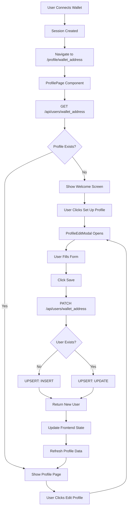
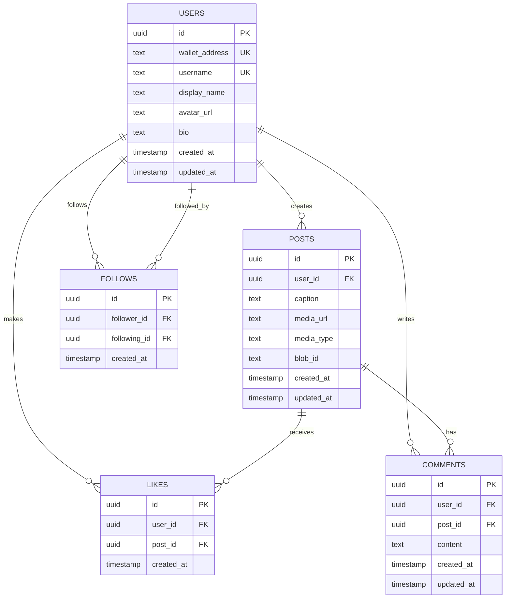
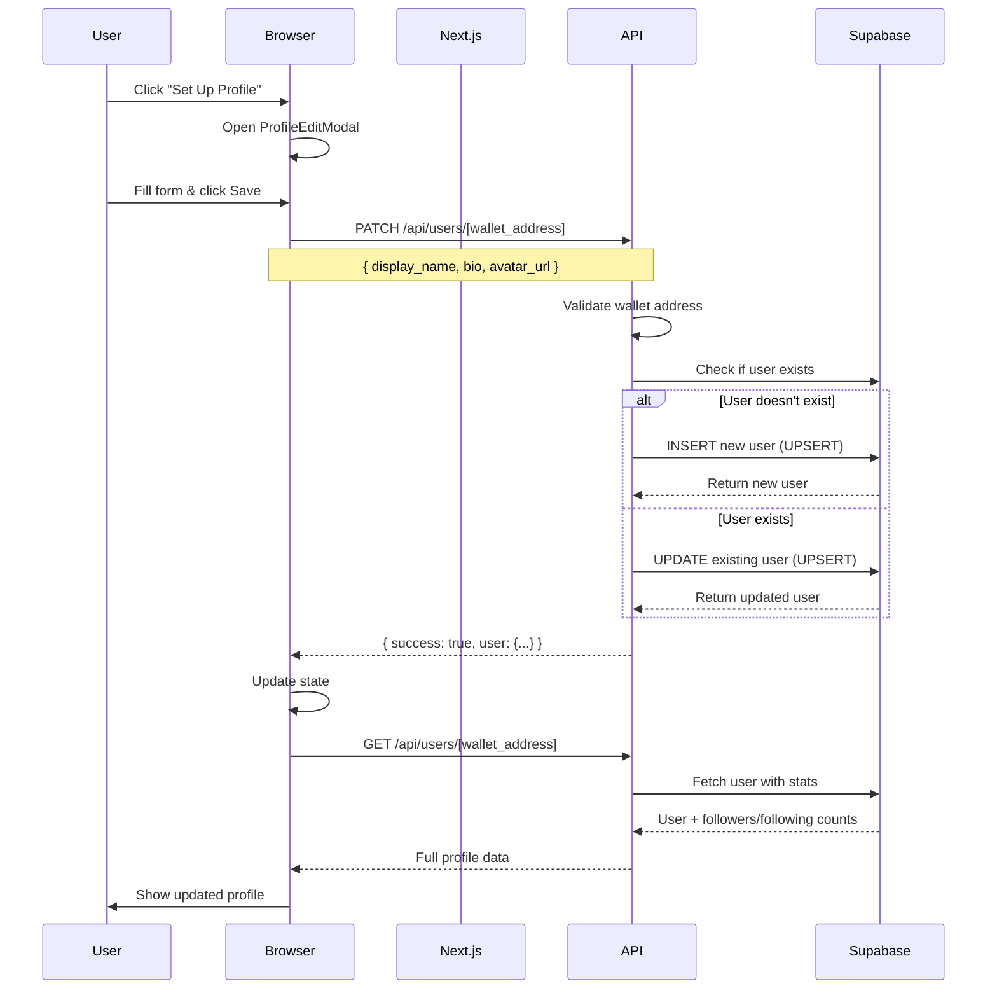
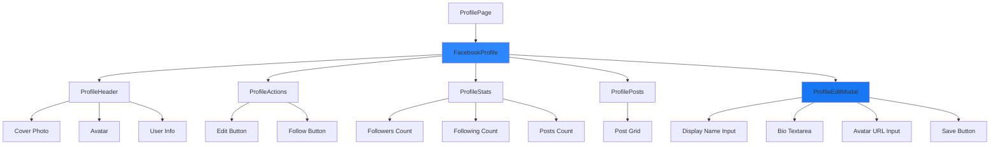
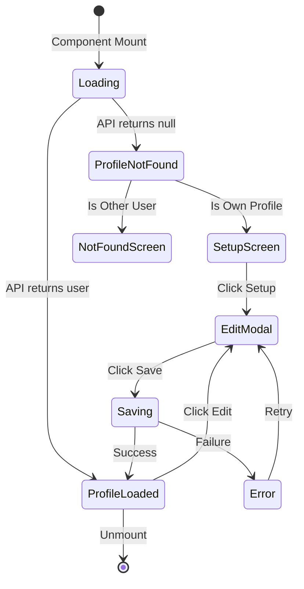
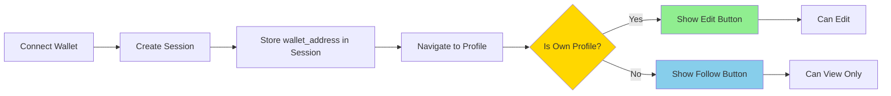
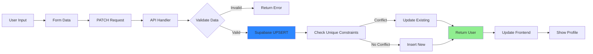

# Profile System Architecture Diagram

## System Flow Diagram

## Database Schema Diagram

## API Request Flow

## Component Hierarchy

## State Management Flow

## Authentication & Authorization Flow

## Data Flow: Create New Profile

## Viewing the Diagrams

To view these Mermaid diagrams:

1. **GitHub/GitLab:** View this file on GitHub - diagrams render automatically
2. **VS Code:** Install "Markdown Preview Mermaid Support" extension
3. **Online:** Copy diagram code to https://mermaid.live/
4. **Documentation Site:** Use any docs platform that supports Mermaid (Docusaurus, VuePress, etc.)

## Understanding the Architecture

### Key Concepts

1. **UPSERT Pattern**: Single operation that creates OR updates based on unique constraint
2. **Wallet-First Design**: Profiles are keyed by wallet address, not email
3. **Optimistic UI**: UI updates immediately, then confirms with server
4. **Profile Ownership**: Determined by comparing wallet addresses
5. **Graceful Degradation**: Shows setup screen for new users, not errors

### Data Flow Principles

1. **Server Components** fetch initial data (page.tsx)
2. **Client Components** handle interactivity (FacebookProfile.tsx)
3. **API Routes** validate and persist to database
4. **State Management** keeps UI in sync with backend
5. **Session** provides authentication context

### Security Model

1. **Authentication**: Wallet signature proves identity
2. **Session**: Server-side cookie stores wallet address
3. **Authorization**: Client-side checks (future: add server-side)
4. **Validation**: API validates all inputs
5. **Constraints**: Database enforces uniqueness

## Next Steps

- Review these diagrams to understand the architecture
- Follow QUICK_START.md to set up the system
- Use DEPLOYMENT_CHECKLIST.md to test thoroughly
- Refer to IMPLEMENTATION_SUMMARY.md for details
